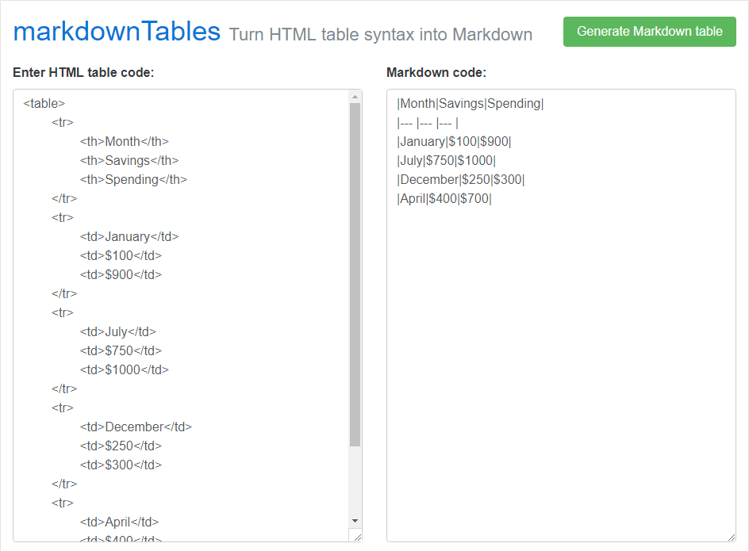

# markdownTables - Turn HTML table syntax into Markdown

markdownTables is a simple online tool which enables you to paste in your HTML table code and convert it to Markdown table syntax.

**Use it online**: [https://jmalarcon.github.io/markdowntables](https://jmalarcon.github.io/markdowntables)

This tool was originally created by [Mark Moffat](https://github.com/mrvautin) and hosted at [his blog](https://mrvautin.com/). But it disappeared. I had a local copy where I fixed a couple of bugs. Since Mark has no repo for this tool in Github, I decided to upload it to my Github space. And here we are :-)

